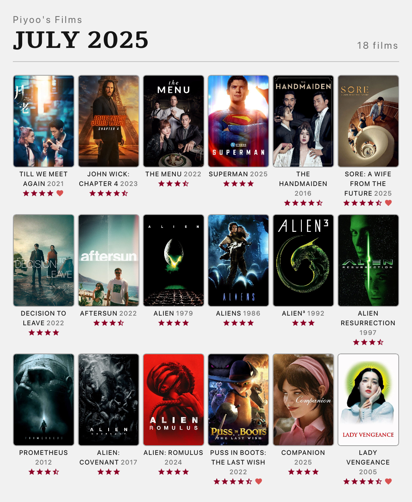

# Wrappedboxd
A single page application that generates image template of monthly film watches from Letterboxd. Uses TMDB API to fetch film posters.

### How to Use
- Visit your account settings on Letterboxd.
- Go to the `data` tab and click `export your data`. You need to have diary entries on Letterboxd to be able to display your data on Wrappedboxd.
- Add the recently downloaded data into Wrappedboxd.
